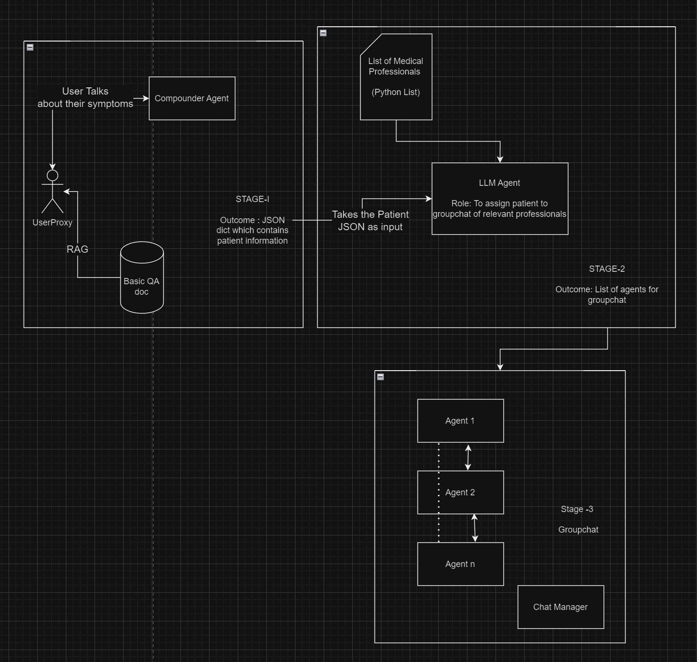

# Diagnosis-Bot
Provides preliminary medical diagnoses based on user symptoms and history.

# Proposed 3 Stage Prompt Architecture : 



## Stage 1 : 
- We have a `CompounderAgent` and a `CompounderProxyAgent`.
- The `CompounderProxyAgent` is representing the user.
- The `CompounderAgent` asks the `CompounderProxyAgent` some of the most basic questions (to get primary symptoms) from a document titled `2_Questioning_Framework_Level_1.md`
- The information is compiled to a `user_symptoms.json` file.

## Stage 2 : 
- There is an _AI agent_ whose role is to assign relevant medical professionals to the user/patient.
- It uses data from `user_symptoms.json` file.
- It consists of a list of medical professionals in the file named `1_List_of_Medical_Professionals.md`.
- The medical professionals are selected by the _AI agent_ based on `user_symptoms.json` file. To create a group, it is mandatory to have at least three agent in the group.
- The selected medical professionals are compiled to `selected_agents.json`.

## Stage 3 : 
- The selected agents are loaded from `selected_agents.json` file and are added to a group chat.
- The `user_symptoms.json` file is loaded as well.
- A `ChatManagerAgent` is created to manage the group chat.
- Then the `CompounderProxyAgent` initiates the group chat.
- It then forwards `user_symptoms.json` file to the group chat and asks to diagnose the user.
  - The agents try to diagnose the user by going through their symptoms.
  - They might ask detailed questions pertaining to the user's lifestyle and symptoms and health history.
  - These questions are asked strictly with reference to the the following documents:
```
3_Primary_Complaint_Symptom_Level_2.md
4_Health_History_Level_2.md
5_Lifestyle_Factors_Level_2.md
6_Environmental_Occupational_Factors_Level_2.md
```
  - There is a dialogue between the group of agents and the user (`CompounderProxyAgent`) until they arrive at a diagnosis.
  - They stick to the Occam's Razor principle while diagnosing the user.
<br>
<br>

# Instructions to Run 

1. Clone this repository onto your system : <br>
```bash
git clone "https://github.com/FreeGym/Diagnosis-Bot.git"
```

2. Navigate to the cloned directory : <br>
```bash
cd Diagnosis-Bot
```


3. Create a conda environment from the ```environment.yml``` file : <br> 
```bash 
conda create -f environment.yml
```

4. Activate the conda environment : <br>
```bash
conda activate diagnosis_bot
```

5. Run the application using the following command: <br>
```bash
python src/main.py
```